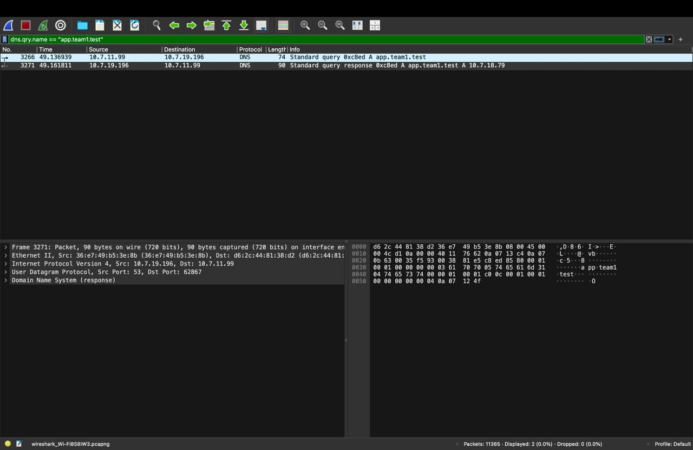
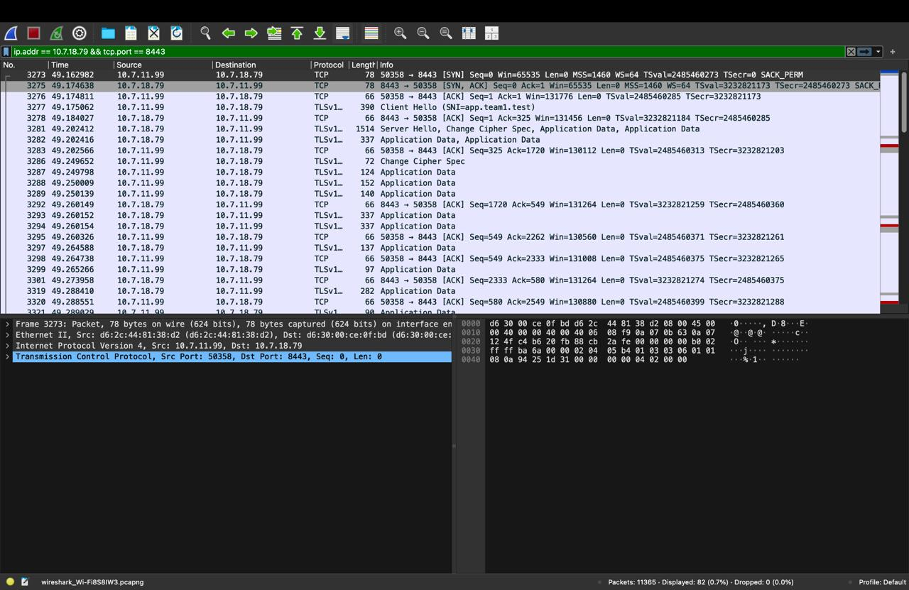

# Private Network Service Platform
## Computer Networks Capstone Course Project — Team Baby Shark

### Core Principle
> "The application stays simple; the network is the project."

---

## 1. Project Purpose and Overview

This project implements a fully functional, highly available private network service platform deployed across four physical macOS workstations connected to an isolated local area network (LAN) on campus Wi-Fi (`10.7.0.0/16`). Without relying on external cloud providers, pre-configured managed services, or public domain registrars, the platform demonstrates the complete lifecycle of a client network request from name resolution to encrypted application delivery.

### Client Request Lifecycle
A client machine on the private network:
1. **Name Resolution**: Issues a DNS query using a private domain name (`app.team1.test`).
2. **Authoritative Resolution**: Resolves the domain via an internal authoritative DNS server running `dnsmasq` on Mac 1 to the Edge IP (`10.7.18.79`).
3. **Transport & Cryptographic Handshake**: Establishes a TCP connection on port `8443` and completes a secure Transport Layer Security (TLS 1.2 / 1.3) handshake with Server Name Indication (SNI) against an `nginx` reverse proxy on Mac 2.
4. **Load Balancing & Upstream Proxying**: Dispatches the request through a round-robin load balancer to one of two isolated backend application server instances (Mac 3 on port `3001` or Mac 4 on port `3002`).
5. **Caching & Protocol Verification**: Returns JSON payloads with backend identification headers (`X-Backend: A` / `X-Backend: B`), HTTP caching directives (`Cache-Control: max-age=60`, `ETag`), and supports conditional revalidation (`304 Not Modified`).
6. **Network Observability**: Observes, captures, and validates every protocol transition across the stack using tools including `curl`, `dig`, `nslookup`, `openssl`, and `Wireshark`.

---

## 2. Team Organization and Machine Roles

The platform distributes network responsibilities across four distinct physical macOS laptops. Each workstation assumes a defined network role mapping directly to modern enterprise and cloud architectural equivalents:

| Machine | Team Member | Enrollment | Hostname | Primary Network Role | Services Running | Network Endpoints & Ports | Cloud Infrastructure Equivalent |
|:---|:---|:---:|:---|:---|:---|:---|:---|
| **Mac 1** | **Yug Johri** | 2401010520 | `cn-dns` | Private DNS Resolver + Test Client | `dnsmasq` 2.93, `dig`, `nslookup`, `curl` | `10.7.19.196:53` (UDP/TCP) | Managed DNS (AWS Route 53, CoreDNS) |
| **Mac 2** | **Anshvardhan Badkur** | 2401010083 | `cn-edge` | Edge Reverse Proxy + Load Balancer + TLS Termination | `nginx` 1.31.6, mkcert / OpenSSL TLS Engine | `10.7.18.79:8080` (HTTP), `10.7.18.79:8443` (HTTPS) | Cloud Load Balancer (AWS ALB, GCP NLB), CDN Edge |
| **Mac 3** | **Ishita Thakur** | — | `cn-backend-a` | Backend Application Server 1 | Node.js / Express REST Service | `10.7.17.218:3001` (HTTP) *(DHCP moved from 10.7.11.99)* | Application Server Instance A (AWS EC2 / ECS) |
| **Mac 4** | **Aditya Verma** | 2401010040 | `cn-backend-b` | Backend Application Server 2 + Test Client | Python Flask / Werkzeug REST Service, `curl` | `10.7.31.47:3002` (HTTP) | Application Server Instance B + Internal Consumer |

**Repository**: [Mystic-commits/Project_Snorlax](https://github.com/Mystic-commits/Project_Snorlax)

---

## 3. Network Inventory and Addressing Scheme

The cluster operates on a private Class A local area subnet (`10.7.0.0/16`). All addresses are statically verified to prevent DHCP contention during live evaluation:

| Machine Role | Machine Node | Hostname | Assigned IPv4 Address | Subnet Mask | Active Interface | Physical Hardware / Notes |
|:---|:---|:---|:---|:---|:---|:---|
| **DNS Server** | Mac 1 (Yug) | `cn-dns` | `10.7.19.196` | `255.255.0.0` (/16) | `en0` (Wi-Fi) | Authoritative for `*.team1.test` |
| **Edge Proxy / TLS** | Mac 2 (Ansh) | `cn-edge` | `10.7.18.79` | `255.255.0.0` (/16) | `en0` (Wi-Fi) | MAC: `d6:2c:44:81:38:d2` |
| **Backend A** | Mac 3 (Ishita) | `cn-backend-a` | `10.7.17.218` | `255.255.0.0` (/16) | `en0` (Wi-Fi) | Express runtime, port 3001 *(was 10.7.11.99 on Oct 1)* |
| **Backend B** | Mac 4 (Aditya) | `cn-backend-b` | `10.7.31.47` | `255.255.0.0` (/16) | `en0` (Wi-Fi) | Flask / Werkzeug runtime, port 3002 |

### Reserved Namespace
- **Primary Domain**: `app.team1.test`
- **API Alias**: `api.team1.test`
- **Reserved Top-Level Domain (TLD)**: `.test` (RFC 2606 and RFC 6761 compliant, preventing conflicts with macOS Multicast DNS / Bonjour `.local` domains).

---

## 4. End-to-End Network Topology and Request Flow

### 4.1 Topology Diagram

```
+---------------------------------------------------------------------------------------+
|                                    PRIVATE LAN                                        |
|                                    10.7.0.0/16                                        |
+---------------------------------------------------------------------------------------+
            |                                                      |
            |                                                      |
    [1] DNS Query (UDP 53)                                  [2] DNS Response
    "app.team1.test?"                                       "10.7.18.79"
            |                                                      |
            v                                                      |
+--------------------------+                                       |
|          MAC 1           | --------------------------------------+
|        Yug Johri         |
|    Private DNS Server    |
|       (dnsmasq:53)       |
+--------------------------+
            ^
            |
    +---------------+
    |  CLIENT NODE  |
    | (Mac 1/Mac 4) |
    +---------------+
            |
            | [3] TCP 3-Way Handshake (SYN -> SYN-ACK -> ACK on TCP 8443)
            | [4] TLS 1.2/1.3 Handshake (ClientHello -> ServerHello -> Cert -> Finished)
            | [5] Encrypted HTTPS Request: GET /api/status (SNI: app.team1.test)
            v
+---------------------------------------------------------------------------------------+
|                                        MAC 2                                          |
|                                  Anshvardhan Badkur                                   |
|                      Edge Reverse Proxy & Round-Robin Load Balancer                   |
|                                    (nginx:8443)                                       |
|                                                                                       |
|   TLS Termination Point                                                               |
|   Upstream Group: backend_pool                                                        |
|     - 10.7.17.218:3001 (Backend A)                                                    |
|     - 10.7.31.47:3002  (Backend B)                                                    |
+---------------------------------------------------------------------------------------+
                |                                                   |
                | [6a] HTTP/1.1 Request                             | [6b] HTTP/1.1 Request
                |      Round-Robin Turn 1                           |      Round-Robin Turn 2
                v                                                   v
+-------------------------------+                   +-------------------------------+
|             MAC 3             |                   |             MAC 4             |
|         Ishita Thakur         |                   |         Aditya Verma          |
|       Backend Server A        |                   |       Backend Server B        |
|       (HTTP Port 3001)        |                   |       (HTTP Port 3002)        |
|                               |                   |                               |
| Responds:                     |                   | Responds:                     |
| - Header: X-Backend: A        |                   | - Header: X-Backend: B        |
| - Header: ETag: "A-v1"        |                   | - Header: ETag: "B-v1"        |
| - Cache-Control: max-age=60   |                   | - Cache-Control: max-age=60   |
| - Body: {"backend":"A",...}   |                   | - Body: {"backend":"B",...}   |
+-------------------------------+                   +-------------------------------+
                |                                                   |
                +-------------------------+-------------------------+
                                          |
                                [7] Backend Response
                                          |
                                          v
                              (TLS Encrypted Return)
                                          |
                                          v
                                    [CLIENT NODE]
                                  HTTP/2 200 OK
                                  X-Backend: A / B
```

### 4.2 Detailed Request Lifecycle
1. **Name Lookup (Application Layer / UDP)**: The client application issues a DNS query for `app.team1.test` via UDP port 53 targeting Mac 1 (`10.7.19.196` running `dnsmasq`).
2. **Authoritative Answer**: Mac 1 returns the A record `10.7.18.79` (Mac 2 Edge).
3. **Transport Layer Connection (TCP)**: The client initiates an active TCP open to socket `10.7.18.79:8443` through a standard three-way handshake (`SYN`, `SYN-ACK`, `ACK`).
4. **Cryptographic Negotiation (TLS)**: Over the established TCP socket, client and edge negotiate TLS ciphers, exchange keys, and validate the Subject Alternative Name (SAN) certificate issued to `app.team1.test`.
5. **Encrypted Application Data (HTTPS)**: The client transmits `GET /api/status HTTP/2` encrypted inside TLS records (with SNI `app.team1.test`).
6. **TLS Termination and Upstream Proxy**: Mac 2 decrypts the request at the edge, checks the upstream load-balancing pool (`backend_pool`), appends proxy headers (`X-Real-IP`, `X-Forwarded-For`, `X-Forwarded-Proto`), and initiates an internal HTTP/1.1 connection to either Mac 3 (`10.7.17.218:3001`) or Mac 4 (`10.7.31.47:3002`).
7. **Backend Processing**: The target backend processes the REST call and returns JSON payload along with backend identifier headers (`X-Backend: A` or `X-Backend: B`) and HTTP caching directives (`Cache-Control: max-age=60`, `ETag`).
8. **Client Delivery**: Mac 2 encapsulates the upstream response inside the TLS session and delivers it to the client. The client receives the response with complete protocol integrity.

---

## 5. OSI vs TCP/IP Protocol Stack Mapping

The following table documents how every protocol implemented in this project maps across both the ISO/OSI 7-Layer Reference Model and the Internet (TCP/IP) Protocol Suite:

| OSI Layer | TCP/IP Layer | Protocol / Technology | Implementation in this Project | Observation & Verification Method |
|:---|:---|:---|:---|:---|
| **Layer 7: Application** | Application | DNS (Domain Name System) | `dnsmasq` authoritative service resolving `app.team1.test` to `10.7.18.79` | `dig @10.7.19.196 app.team1.test`, `nslookup`, Wireshark filter `dns` |
| **Layer 7: Application** | Application | HTTP/1.1 & HTTP/2 | REST endpoints `/`, `/api/status`, `/api/cached`, custom headers `X-Backend`, `Cache-Control`, `ETag` | `curl -i`, browser dev tools, Wireshark filter `http` |
| **Layer 6: Presentation** | Application / Transport | TLS 1.2 / TLS 1.3 | Cryptographic handshakes, RSA/ECDSA key exchange, AES-GCM data encryption terminated at Mac 2 | `openssl s_client`, Wireshark filter `tls` |
| **Layer 5: Session** | Application / Transport | TLS Session Management | Session establishment, cipher negotiation, connection keep-alive | OpenSSL session output, Wireshark `ChangeCipherSpec` / `Encrypted Handshake Message` |
| **Layer 4: Transport** | Transport | TCP (Transmission Control) | End-to-end reliable byte stream, 3-way handshake (`SYN`-`SYN/ACK`-`ACK`), sequence/ACK numbering, flow control | Wireshark filter `tcp.port == 8443`, `tcp.flags.syn == 1` |
| **Layer 4: Transport** | Transport | UDP (User Datagram) | Low-overhead connectionless queries for DNS resolution on port 53 | Wireshark filter `udp.port == 53` |
| **Layer 3: Network** | Internet | IPv4 & ICMP | Private addressing (`10.7.0.0/16`), routing between nodes, ICMP echo request/reply | `ping 10.7.18.79`, `netstat -nr`, `ipconfig getifaddr en0` |
| **Layer 2: Data Link** | Network Access / Link | IEEE 802.11 Wi-Fi / Ethernet | MAC frame addressing, ARP resolution between IP addresses and physical hardware (`d6:2c:44:81:38:d2`) | `arp -a`, Wireshark frame layer analysis |
| **Layer 1: Physical** | Network Access / Link | Physical Transceiver | Wireless RF (2.4GHz/5GHz 802.11) / physical network medium | Interface carrier status (`ifconfig en0 status: active`) |

---

## 6. Phase 1: Build and Observe (Mandatory Tasks)

### Task A: Establish the Private LAN
- **Objective**: Interconnect all four macOS workstations on an isolated private Wi-Fi/LAN segment (`10.7.0.0/16`) and confirm full IP reachability.
- **Verification Commands**:
  ```bash
  # Check active IP address on en0
  ipconfig getifaddr en0

  # Verify bidirectional connectivity to all peers
  ping -c 3 10.7.18.79     # Mac 2 (Edge Nginx)
  ping -c 3 10.7.17.218    # Mac 3 (Backend A)
  ping -c 3 10.7.31.47     # Mac 4 (Backend B)
  ```
- **Success Criteria**: 0% packet loss across all pairwise host ping checks.
- **Evidence Reference**: [Mac1-TaskA-dnsmasq-listen.png](evidence/task-a/Mac1-TaskA-dnsmasq-listen.png)

---

### Task B: Configure a Private DNS Server (Mac 1: Yug Johri)
- **Objective**: Mac 1 runs `dnsmasq` to serve private authoritative DNS records for the `.test` namespace.
- **Configuration** (`/opt/homebrew/etc/dnsmasq.conf` & `/opt/homebrew/etc/dnsmasq.d/project.conf` on Mac 1):
  ```conf
  # /opt/homebrew/etc/dnsmasq.conf
  listen-address=10.7.19.196,127.0.0.1
  bind-interfaces
  server=8.8.8.8
  log-queries
  log-facility=/tmp/dnsmasq.log

  # /opt/homebrew/etc/dnsmasq.d/project.conf
  address=/app.team1.test/10.7.18.79
  address=/api.team1.test/10.7.18.79
  local-ttl=30
  ```
- **Client Configuration**:
  On Mac 2, Mac 3, and Mac 4, point DNS resolvers to Mac 1:
  ```bash
  sudo networksetup -setdnsservers Wi-Fi 10.7.19.196
  sudo dscacheutil -flushcache
  sudo killall -HUP mDNSResponder
  ```
- **Verification Commands**:
  ```bash
  # Query team DNS directly
  dig @10.7.19.196 app.team1.test +short
  # Expected output: 10.7.18.79

  # Standard resolution via system resolver
  nslookup app.team1.test
  ```
- **Automated Test**: `./tests/dns-test.sh`
- **Evidence References**:
  - [Mac1-TaskB-dnsmasq-config.png](evidence/task-b/Mac1-TaskB-dnsmasq-config.png)
  - [Mac1-TaskB-DNS-Resolution.png](evidence/task-b/Mac1-TaskB-DNS-Resolution.png)
  - [Mac3-TaskB-dig-via-team-dns.jpg](evidence/task-b/Mac3-TaskB-dig-via-team-dns.jpg)
  - [Mac3-TaskB-nslookup.jpg](evidence/task-b/Mac3-TaskB-nslookup.jpg)

---

### Task C: Build Two Simple Backend Services
- **Objective**: Mac 3 and Mac 4 run independent lightweight HTTP REST services.
- **Service Specifications**:
  - **Backend A (Mac 3: Ishita Thakur)**: Node.js / Express binding to `0.0.0.0:3001`.
  - **Backend B (Mac 4: Aditya Verma)**: Python Flask / Werkzeug binding to `0.0.0.0:3002`.
  - Endpoints:
    - `GET /`: Returns JSON status object with `"service": "TeamBabyShark"`.
    - `GET /api/status`: Returns JSON status object (`{"backend": "A"|"B", "status": "ok"}`).
    - `GET /api/cached`: Returns cacheable content with `ETag: "v1"`.
  - Required Response Headers:
    - `X-Backend: A` (Mac 3) / `X-Backend: B` (Mac 4)
    - `Cache-Control: max-age=60`
    - `ETag: "A-v1"` / `"B-v1"` (or `"v1"`)
- **Direct Backend Verification (from Mac 2)**:
  ```bash
  curl -i http://10.7.17.218:3001/api/status
  curl -i http://10.7.31.47:3002/api/status
  ```
- **Evidence References**:
  - [Mac2-TaskC-Direct-Backends.jpg](evidence/task-c/Mac2-TaskC-Direct-Backends.jpg)
  - [Mac3-TaskC-BackendA-node-server.jpg](evidence/task-c/Mac3-TaskC-BackendA-node-server.jpg)
  - [Mac4-TaskC-BackendB-python-app.jpg](evidence/task-c/Mac4-TaskC-BackendB-python-app.jpg)

---

### Task D: Configure Edge Reverse Proxy and Load Balancer (Mac 2: Anshvardhan)
- **Objective**: Mac 2 acts as the unified reverse proxy using `nginx`, terminating TLS and distributing traffic round-robin across backends.
- **Configuration** (`/opt/homebrew/etc/nginx/servers/team1.conf` on Mac 2):
  ```nginx
  upstream backend_pool {
      server 10.7.17.218:3001;
      server 10.7.31.47:3002;
  }

  server {
      listen 8080;
      server_name app.team1.test api.team1.test;

      location / {
          proxy_pass http://backend_pool;
          proxy_http_version 1.1;
          proxy_set_header Host $host;
          proxy_set_header X-Real-IP $remote_addr;
          proxy_set_header X-Forwarded-For $proxy_add_x_forwarded_for;
          proxy_set_header X-Forwarded-Proto $scheme;
      }
  }

  server {
      listen 8443 ssl;
      http2 on;
      server_name app.team1.test api.team1.test;

      ssl_certificate     /opt/homebrew/etc/nginx/certs/app.team1.test+1.pem;
      ssl_certificate_key /opt/homebrew/etc/nginx/certs/app.team1.test+1-key.pem;
      ssl_protocols       TLSv1.2 TLSv1.3;

      location / {
          proxy_pass http://backend_pool;
          proxy_http_version 1.1;
          proxy_set_header Host $host;
          proxy_set_header X-Real-IP $remote_addr;
          proxy_set_header X-Forwarded-For $proxy_add_x_forwarded_for;
          proxy_set_header X-Forwarded-Proto https;
      }
  }
  ```
- **Automated Verification**:
  ```bash
  ./tests/load-balancing-test.sh
  ```
- **Verified Live Output**:
  ```
  X-Backend: A
  X-Backend: A
  X-Backend: B
  X-Backend: A
  X-Backend: B
  X-Backend: A
  ```
- **Evidence References**:
  - [Mac2-TaskD-HTTPS-LoadBalancing.jpg](evidence/task-d/Mac2-TaskD-HTTPS-LoadBalancing.jpg)
  - [Mac3-TaskD-LoadBalancing.jpg](evidence/task-d/Mac3-TaskD-LoadBalancing.jpg)
  - [Mac4-TaskD-LoadBalancing.jpg](evidence/task-d/Mac4-TaskD-LoadBalancing.jpg)

---

### Task E: Add HTTPS / TLS Termination
- **Objective**: Implement valid cryptographic TLS termination on Mac 2 with a Subject Alternative Name (SAN) certificate trusted by all client nodes.
- **Certificate Issuance**:
  ```bash
  # Using mkcert on Mac 2
  brew install mkcert
  mkcert -install
  cd /opt/homebrew/etc/nginx/certs
  mkcert app.team1.test api.team1.test
  ```
- **Strict Verification (No `-k` or `--insecure` required when root CA is trusted)**:
  ```bash
  curl -i --cacert "$(mkcert -CAROOT)/rootCA.pem" \
    --resolve app.team1.test:8443:10.7.18.79 \
    https://app.team1.test:8443/api/status
  ```
- **Verified Response**:
  ```http
  HTTP/2 200 
  server: nginx/1.31.6
  date: Mon, 05 Oct 2026 11:56:29 GMT
  content-type: application/json; charset=utf-8
  content-length: 29
  x-powered-by: Express
  x-backend: A
  cache-control: max-age=60
  etag: W/"1d-/mMMZex8nvIDi44lSUobi0vFg/M"

  {"backend":"A","status":"ok"}
  ```
- **Evidence References**:
  - [Mac2-TaskE-mkcert-HTTPS.jpg](evidence/task-e/Mac2-TaskE-mkcert-HTTPS.jpg)
  - [Mac3-TaskE-HTTPS.jpg](evidence/task-e/Mac3-TaskE-HTTPS.jpg)

---

### Task F: Demonstrate HTTP Caching Behavior
- **Objective**: Prove HTTP cache control, entity tags (ETags), and conditional revalidation.
- **Workflow**:
  1. **Initial Request**: Client requests the resource and receives `Cache-Control: max-age=60` and `ETag: "v1"`.
  2. **Conditional Validation**: Client issues a subsequent request with `If-None-Match: "v1"`.
  3. **Server Response**: Backend validates the unchanged state and returns `HTTP/1.1 304 Not Modified` with zero response body, eliminating redundant bandwidth consumption.
- **Execution**:
  ```bash
  # Step 1: Initial Fresh Request
  curl -i https://app.team1.test:8443/api/cached

  # Step 2: Conditional Revalidation Request
  curl -i -H 'If-None-Match: "v1"' https://app.team1.test:8443/api/cached
  ```
- **Verified Output (304 Not Modified)**:
  ```http
  HTTP/1.1 304 NOT MODIFIED
  Server: Werkzeug/3.1.9 Python/3.13.5
  Date: Thu, 01 Oct 2026 05:42:42 GMT
  Cache-Control: max-age=60
  ETag: "v1"
  X-Backend: B
  Connection: close
  ```
- **Evidence References**:
  - [Mac2-TaskF-Cache-ETag.jpg](evidence/task-f/Mac2-TaskF-Cache-ETag.jpg)
  - [Mac4-TaskF-304-via-nginx.jpg](evidence/task-f/Mac4-TaskF-304-via-nginx.jpg)
  - [Mac4-TaskF-Cache-200-and-304.jpg](evidence/task-f/Mac4-TaskF-Cache-200-and-304.jpg)

---

### Task G: Capture Complete Protocol Flow (Wireshark)
- **Objective**: Dissect and observe the complete end-to-end client packet trace in Wireshark from DNS query to encrypted application data exchange.
- **Capture File**: [`evidence/task-g/CNPhase1_Wireshark_Capture.pcapng`](evidence/task-g/CNPhase1_Wireshark_Capture.pcapng)

#### 1. DNS Resolution (UDP Port 53)
- **Packet Dissection**:
  - **Frame 3266**: `10.7.11.99 -> 10.7.19.196` | DNS | `Standard query 0xc8ed A app.team1.test`
  - **Frame 3271**: `10.7.19.196 -> 10.7.11.99` | DNS | `Standard query response 0xc8ed A app.team1.test A 10.7.18.79`
- **Wireshark Evidence**:
  
  *Reference: [Mac3-TaskG-DNS-Query-Response.jpg](evidence/task-g/Mac3-TaskG-DNS-Query-Response.jpg)*

#### 2. TCP 3-Way Handshake & TLS 1.2/1.3 Handshake (TCP Port 8443)
- **Packet Dissection**:
  - **Frame 3273**: `Client (10.7.11.99:50358) -> Edge (10.7.18.79:8443)` | TCP | `[SYN] Seq=0 Win=65535 Len=0 MSS=1460`
  - **Frame 3275**: `Edge (10.7.18.79:8443) -> Client (10.7.11.99:50358)` | TCP | `[SYN, ACK] Seq=0 Ack=1 Win=65535 Len=0 MSS=1460`
  - **Frame 3276**: `Client (10.7.11.99:50358) -> Edge (10.7.18.79:8443)` | TCP | `[ACK] Seq=1 Ack=1 Win=131776 Len=0`
  - **Frame 3277**: `Client -> Edge` | TLSv1.3 | `Client Hello (SNI=app.team1.test)`
  - **Frame 3278**: `Edge -> Client` | TCP | `[ACK]`
  - **Frame 3281**: `Edge -> Client` | TLSv1.3 | `Server Hello, Change Cipher Spec, Application Data`
  - **Frames 3286-3321**: `TLS Change Cipher Spec` and encrypted `Application Data`
- **Wireshark Evidence**:
  
  *Reference: [Mac3-TaskG-TCP-TLS-Handshake.jpg](evidence/task-g/Mac3-TaskG-TCP-TLS-Handshake.jpg)*

---

## 7. Verified Evidence and Demonstration Proofs

All core Phase 1 tasks have been verified live across the four physical Macs and archived in the repository:

| Task | Test Description | Captured Evidence File | Verified Output / Diagnostic Summary |
|:---:|:---|:---|:---|
| **Task A** | LAN reachability & dnsmasq listener | [Mac1-TaskA-dnsmasq-listen.png](evidence/task-a/Mac1-TaskA-dnsmasq-listen.png) | dnsmasq listening on `10.7.19.196:53`, verified with `dig @10.7.19.196` returning `10.7.18.79`. |
| **Task B** | dnsmasq configuration file | [Mac1-TaskB-dnsmasq-config.png](evidence/task-b/Mac1-TaskB-dnsmasq-config.png) | `listen-address=10.7.19.196`, `address=/app.team1.test/10.7.18.79`, `server=8.8.8.8`. |
| **Task B** | Local DNS resolution check | [Mac1-TaskB-DNS-Resolution.png](evidence/task-b/Mac1-TaskB-DNS-Resolution.png) | `dig @10.7.19.196 app.team1.test +short` returns `10.7.18.79`. |
| **Task B** | Remote nslookup from Mac 3 | [Mac3-TaskB-nslookup.jpg](evidence/task-b/Mac3-TaskB-nslookup.jpg) | Client on Mac 3 queries Server `10.7.19.196#53`, resolves `app.team1.test` to `10.7.18.79`. |
| **Task B** | Remote dig resolution from Mac 3 | [Mac3-TaskB-dig-via-team-dns.jpg](evidence/task-b/Mac3-TaskB-dig-via-team-dns.jpg) | Query to `10.7.19.196#53` succeeds with `NOERROR`, Answer `10.7.18.79`. |
| **Task C** | Direct backend connectivity from Mac 2 | [Mac2-TaskC-Direct-Backends.jpg](evidence/task-c/Mac2-TaskC-Direct-Backends.jpg) | Mac 2 directly curls Backend A (`:3001` Express) and Backend B (`:3002` Python), verifying both return 200. |
| **Task C** | Node.js Backend A startup & status | [Mac3-TaskC-BackendA-node-server.jpg](evidence/task-c/Mac3-TaskC-BackendA-node-server.jpg) | Backend A starts on `:3001`, responds with `{"backend":"A","status":"ok"}`. |
| **Task C** | Python Backend B execution & status | [Mac4-TaskC-BackendB-python-app.jpg](evidence/task-c/Mac4-TaskC-BackendB-python-app.jpg) | Backend B starts on `:3002`, responds with `{"backend":"B","status":"ok"}`. |
| **Task D** | HTTPS load-balancing from Mac 2 | [Mac2-TaskD-HTTPS-LoadBalancing.jpg](evidence/task-d/Mac2-TaskD-HTTPS-LoadBalancing.jpg) | `curl -k` on `:8443` alternates between `x-backend: B` and `x-backend: A`. |
| **Task D** | Load-balancing verified from Mac 3 | [Mac3-TaskD-LoadBalancing.jpg](evidence/task-d/Mac3-TaskD-LoadBalancing.jpg) | 10-request loop alternating evenly between `x-backend: A` and `x-backend: B`. |
| **Task D** | Load-balancing verified from Mac 4 | [Mac4-TaskD-LoadBalancing.jpg](evidence/task-d/Mac4-TaskD-LoadBalancing.jpg) | Sequential curls against `:8443` displaying alternating `x-backend: A` and `B`. |
| **Task E** | mkcert SAN certificate on Mac 2 | [Mac2-TaskE-mkcert-HTTPS.jpg](evidence/task-e/Mac2-TaskE-mkcert-HTTPS.jpg) | mkcert SAN cert configured; Nginx serves HTTP/2 over TLS 1.3 on port 8443. |
| **Task E** | Trusted HTTPS fetch from Mac 3 | [Mac3-TaskE-HTTPS.jpg](evidence/task-e/Mac3-TaskE-HTTPS.jpg) | HTTP/2 200 OK returned over port 8443 with trusted cert. |
| **Task F** | Cache-Control & ETag headers | [Mac2-TaskF-Cache-ETag.jpg](evidence/task-f/Mac2-TaskF-Cache-ETag.jpg) | Response headers confirm `Cache-Control: max-age=60` and `ETag: W/"1d-..."`. |
| **Task F** | HTTP 304 Not Modified revalidation | [Mac4-TaskF-304-via-nginx.jpg](evidence/task-f/Mac4-TaskF-304-via-nginx.jpg) | `curl -i -H 'If-None-Match: "v1"'` returns `HTTP/1.1 304 NOT MODIFIED`. |
| **Task F** | Cache 200 OK followed by 304 | [Mac4-TaskF-Cache-200-and-304.jpg](evidence/task-f/Mac4-TaskF-Cache-200-and-304.jpg) | Fresh fetch returns 200 OK; cached conditional fetch returns 304 Not Modified. |
| **Task G** | Wireshark DNS Query & Response | [Mac3-TaskG-DNS-Query-Response.jpg](evidence/task-g/Mac3-TaskG-DNS-Query-Response.jpg) | Frame 3266 query `app.team1.test` and frame 3271 response `10.7.18.79`. |
| **Task G** | Wireshark TCP 3-Way & TLS Handshake | [Mac3-TaskG-TCP-TLS-Handshake.jpg](evidence/task-g/Mac3-TaskG-TCP-TLS-Handshake.jpg) | Frame 3273-3276 TCP SYN/SYN-ACK/ACK, Frame 3277 ClientHello (SNI), Frame 3281 ServerHello. |
| **Task G** | Wireshark Packet Capture File | [CNPhase1_Wireshark_Capture.pcapng](evidence/task-g/CNPhase1_Wireshark_Capture.pcapng) | Raw pcapng packet capture archive with 11,365 packets captured during live lab. |
| **Setup** | macOS Firewall rule verification | [Mac1-Firewall-dnsmasq-node.png](evidence/setup/Mac1-Firewall-dnsmasq-node.png) | System Settings Firewall allowing incoming connections for `dnsmasq` and `node`. |

---

## 8. Phase 1 Required Failure Scenarios and Observations

The platform underwent deliberate fault injection and resolved real-world lab anomalies:

| Failure Scenario | Fault Injected / Lab Anomaly | Observed Symptom | Underlying Network Explanation |
|:---|:---|:---|:---|
| **1. Wrong DNS Resolver** | Client DNS was configured to public resolver (`8.8.8.8`) | `dig` returns `NXDOMAIN` for `app.team1.test`. Direct `ping 10.7.18.79` still succeeds. | Proves that the Name Resolution Layer and IP Routing Layer operate independently. Public resolvers do not know private `.test` namespaces. |
| **2. macOS Firewall Blocking DNS** | macOS Application Firewall enabled without exception for `dnsmasq` | Local query `dig @127.0.0.1` works, but LAN queries `dig @10.7.19.196` from Mac 2/3/4 hang with timeout. | Layer 3 ICMP ping was successful, but Layer 4 UDP port 53 packets were silently dropped by `socketfilterfw`. Resolved by adding explicit rule for `dnsmasq`. |
| **3. DHCP Address Drift on Backend A** | Campus Wi-Fi DHCP changed Mac 3 IP from `10.7.11.99` to `10.7.17.218` | All client requests were routed 100% to Backend B; zero requests reached Backend A. | Nginx detected connection refusal / timeout trying to reach stale IP `10.7.11.99:3001` and failed over exclusively to healthy Backend B (`10.7.31.47:3002`). Resolved by updating `upstream backend_pool` and reloading nginx. |
| **4. Backend A Terminated** | Backend A process stopped via `Ctrl+C` | Client continues to receive HTTP 200 OK responses with `X-Backend: B` for 100% of requests with zero downtime. | Demonstrates reverse proxy fault tolerance: Nginx upstream health checking skips the dead socket and proxies to the surviving backend. |
| **5. Both Backends Terminated** | Both Backend A and Backend B processes stopped | DNS resolves to Mac 2; TCP 3-way handshake succeeds; TLS handshake succeeds; Nginx immediately returns `HTTP 502 Bad Gateway`. | Clearly isolates the Edge boundary from the Application boundary. The edge and transport layers function properly, but cannot establish an upstream TCP socket to application servers. |
| **6. Client Connects to Closed Port** | Client attempts connection to `https://app.team1.test:9443` | Client immediately receives `Connection refused` (TCP RST packet received). | Demonstrates that the destination host is reachable at Layer 3 (Network), but no process is listening on the target socket at Layer 4 (Transport). |

---

## 9. Phase 2: Harden, Recover, and Troubleshoot

### Extension A: Backup DNS Resolver and High Availability
- **Architecture**: A secondary `dnsmasq` instance is deployed on Mac 4 (`10.7.31.47`) with identical zone records.
- **Client Configuration**: Clients are configured with dual DNS resolvers:
  ```bash
  sudo networksetup -setdnsservers Wi-Fi 10.7.19.196 10.7.31.47
  ```
- **Demonstration**: When Mac 1 primary DNS is taken offline (`sudo brew services stop dnsmasq`), clients automatically fall back to Mac 4 without interruption.

### Extension B: DNS TTL and Controlled Traffic Cutover
- **Configuration**: DNS records configured with a 30-second TTL (`local-ttl=30`).
- **Demonstration**:
  1. Record updated in `dnsmasq.d/project.conf` to point to a new standby edge IP.
  2. Immediate client queries continue to receive cached answer.
  3. Upon TTL expiration (or manual cache flush via `sudo dscacheutil -flushcache; sudo killall -HUP mDNSResponder`), clients seamlessly transition to the updated address.

### Extension C: Service Isolation via macOS `pf` Packet Filter
- **Objective**: Prevent clients from bypassing the reverse proxy and accessing backend ports 3001 and 3002 directly.
- **Rule Definition** (`/etc/pf.anchors/cn_isolation` on Mac 3 and Mac 4):
  ```
  # Allow traffic to backend ports ONLY from Mac 2 (Edge IP 10.7.18.79)
  pass in quick on en0 proto tcp from 10.7.18.79 to any port {3001, 3002}
  block in quick on en0 proto tcp from any to any port {3001, 3002}
  ```
- **Demonstration**: Direct connection attempt from client Mac fails with `Operation timed out`, while requests routed through `https://app.team1.test:8443` succeed.

### Extension D: High-Availability Failover and Single Point of Failure (SPOF) Analysis
- **Nginx Failover Tuning**:
  ```nginx
  upstream backend_pool {
      server 10.7.17.218:3001 max_fails=2 fail_timeout=5s;
      server 10.7.31.47:3002 max_fails=2 fail_timeout=5s;
  }
  ```
- **SPOF Analysis**: While the backend application layer is fully redundant, Mac 2 (Edge Nginx) remains a Single Point of Failure. In an enterprise production network, this is mitigated by:
  1. Active-passive edge proxies paired with Virtual Router Redundancy Protocol (VRRP / Keepalived) sharing a Virtual IP (VIP).
  2. BGP Anycast routing directing traffic to the nearest surviving edge router.
  3. DNS round-robin across multiple public edge IP addresses.

### Extension E: Systematic Layer-by-Layer Troubleshooting Framework
When diagnosing any unknown network failure, Team Baby Shark follows a strict deterministic bottom-up protocol audit:

```
[Layer 1/2]  Check Physical/Link Status   -> ifconfig en0 (status: active, valid IP assigned)
     |
     v
[Layer 3]    Check IP Reachability         -> ping -c 2 <target_ip> (ICMP Echo)
     |
     v
[Layer 7]    Check Name Resolution         -> dig @<dns_ip> app.team1.test +short
     |
     v
[Layer 4]    Check Transport Port / Socket -> nc -zvw3 <target_ip> 8443
     |
     v
[Layer 5/6]  Check TLS Certificate & Cipher -> openssl s_client -connect <target_ip>:8443 -servername app.team1.test
     |
     v
[Layer 7]    Check Application Response    -> curl -v -i https://app.team1.test:8443/api/status
```

---

## 10. Final Demonstration Runbook (11-Step Evaluation Sequence)

| Step | Action | Execution Command | Evaluator Verification Checklist |
|:---:|:---|:---|:---|
| **1** | Present Topology & IP Inventory | Open project documentation and display network table | Confirm 4 host roles: Mac 1 (DNS), Mac 2 (Edge), Mac 3 (Backend A), Mac 4 (Backend B). |
| **2** | Confirm LAN Reachability | `ping -c 2 10.7.18.79 && ping -c 2 10.7.17.218 && ping -c 2 10.7.31.47` | 0% packet loss, valid ICMP RTT. |
| **3** | Resolve Domain from Client | `dig @10.7.19.196 app.team1.test +short` | Query resolves to Mac 2 IP (`10.7.18.79`) via team DNS. |
| **4** | HTTPS Request via Domain | `curl -i https://app.team1.test:8443/api/status` | HTTP 200 OK returned; trusted certificate with no `-k` bypass. |
| **5** | Demonstrate Load Balancing | `./tests/load-balancing-test.sh` | Alternating `X-Backend: A` and `X-Backend: B` headers observed over 20 requests. |
| **6** | Wireshark Protocol Flow Evidence | Open `.pcapng` in Wireshark (`evidence/task-g/`) | Display DNS query/response, TCP 3-way handshake (`SYN`-`SYN/ACK`-`ACK`), TLS ClientHello and Certificate. |
| **7** | Demonstrate HTTP Caching | `./tests/caching-test.sh` | Confirm `HTTP/1.1 304 Not Modified` and `Cache-Control: max-age=60`. |
| **8** | Fail One Backend | Stop Backend A on Mac 3 (`Ctrl+C`); rerun client curl | Requests continue to succeed seamlessly via Backend B with `X-Backend: B`. |
| **9** | Demonstrate Phase 2 Resilience | Stop Mac 1 DNS; show resolution fallback to Mac 4 secondary | Name resolution continues uninterrupted. |
| **10** | Diagnose Faculty-Injected Fault | Execute 6-step troubleshooting methodology | Systematic diagnosis identifying faulty layer (DNS, TCP, TLS, or Upstream). |
| **11** | Individual Viva Voce | Individual verbal examination | Each student defends their configured component and protocol theory. |

---

## 11. Individual Viva Voce Preparation Guide — Team Baby Shark

### For Yug Johri (Mac 1 — DNS Specialist)
- **What is the difference between an authoritative and recursive DNS server?**
  *dnsmasq in our project acts as an authoritative server for our private zone `*.team1.test` by returning configured IP mappings directly from local config files (`address=/app.team1.test/10.7.18.79`), while forwarding unknown public queries recursively to upstream resolvers (`server=8.8.8.8`).*
- **Why did we use `.test` instead of `.local`?**
  *RFC 6762 reserves `.local` for Multicast DNS (mDNS/Bonjour). On macOS, queries ending in `.local` are intercepted by mDNSResponder over multicast IP `224.0.0.251`, breaking standard unicast DNS resolution.*
- **What happens when a DNS query is sent over UDP vs TCP?**
  *Standard queries use UDP port 53 for low latency. If the DNS response exceeds 512 bytes (or EDNS0 buffer limits) or during zone transfers (AXFR), DNS falls back to TCP port 53.*
- **Why set `local-ttl=30`?**
  *A 30-second TTL prevents client resolvers and intermediate caches from caching stale IP addresses during failovers, allowing quick DNS cutover demonstrations.*

### For Anshvardhan Badkur (Mac 2 — Edge, Proxy, and Security Specialist)
- **What is the difference between a Reverse Proxy and a Forward Proxy?**
  *A forward proxy acts on behalf of clients to access external servers, hiding client identities. A reverse proxy acts on behalf of backend servers, receiving requests from clients, terminating security sessions, and routing internally, hiding backend topology and IP addresses.*
- **How does TLS termination work?**
  *The TLS handshake concludes at the Nginx edge on Mac 2 using the server's private key. The payload is decrypted by Nginx and proxied as plain HTTP over the internal network to backends, offloading cryptographic overhead from application nodes.*
- **Why is SNI (Server Name Indication) required?**
  *SNI is an extension to TLS where the client specifies the requested hostname in the `ClientHello` before certificates are exchanged. This enables a single edge proxy on one IP address to serve multiple virtual hosts with distinct TLS certificates.*
- **What does `proxy_next_upstream` do?**
  *It instructs Nginx that if an upstream backend returns an error, timeout, or 502/503/504, Nginx should transparently retry the request against the next upstream server before returning an error to the client.*

### For Ishita Thakur (Mac 3 — Backend A Specialist)
- **What is an ETag and how does conditional caching save resources?**
  *An ETag (Entity Tag) is an HTTP validator representing a specific version of a resource. When a client includes `If-None-Match: <etag>`, the server checks if the resource has changed; if not, it returns `304 Not Modified` with an empty body, eliminating redundant data transfer.*
- **Why must backend applications bind to `0.0.0.0` instead of `127.0.0.1`?**
  *`127.0.0.1` is the loopback interface, accessible only from processes running locally on the same physical machine. Binding to `0.0.0.0` allows the server socket to listen on all network interfaces, including the LAN IP (`10.7.17.218`), enabling connections from Mac 2.*
- **What happens when your IP changed via DHCP?**
  *Because application code binds to `0.0.0.0`, the code did not change. However, Nginx upstream configuration on Mac 2 had to be updated from the old IP (`10.7.11.99`) to the new IP (`10.7.17.218`) because Nginx routes directly to IP sockets.*

### For Aditya Verma (Mac 4 — Backend B and Client Testing Specialist)
- **What constitutes a TCP socket pair?**
  *A socket pair uniquely identifies a 4-tuple TCP connection: `(Source IP, Source Port, Destination IP, Destination Port)`. For example: `(10.7.31.47, 52194, 10.7.18.79, 8443)`.*
- **What is the difference between an ephemeral port and a well-known port?**
  *Well-known ports (0-1023) and registered ports (1024-49151) are dedicated to specific listening services (e.g., DNS on 53, HTTPS on 8443). Ephemeral ports (49152-65535 on macOS) are dynamically assigned by the client OS kernel for the lifetime of an outgoing connection.*
- **Why was Werkzeug/Flask chosen for Backend B while Node.js was chosen for Backend A?**
  *To prove technology independence at the origin layer. The reverse proxy and client interact purely over standard HTTP/1.1 contracts regardless of whether the backend runtime is Node.js, Python, or Go.*

---

## 12. Repository File Structure

```
Project_Snorlax/
├── README.md                          # Comprehensive Project Documentation
├── edge/
│   ├── README.md                      # Mac 2 Edge Configuration Documentation
│   └── nginx.conf.example             # Production Nginx Reverse Proxy & Load Balancer Config
├── tls/
│   ├── README.md                      # TLS Architecture & Certificate Trust Guide
│   └── openssl.cnf.example            # OpenSSL SAN (Subject Alternative Name) Configuration
├── dns/
│   ├── Readme.md                      # Authoritative DNS Deployment Documentation
│   ├── dnsmasq.conf.example           # Authoritative DNS Server Main Configuration
│   └── project.conf.example           # Private Zone Domain Mappings (.test)
├── backend-a/
│   ├── README.md                      # Backend A Deployment Instructions
│   ├── package.json                   # Node.js Express Package Configuration
│   └── server.js                      # HTTP REST Application Server A (Port 3001)
├── backend-b/
│   ├── README.md                      # Backend B Deployment Instructions
│   ├── app.py                         # Flask REST Application Server B (Port 3002)
│   ├── requirements.txt               # Python Dependencies (Flask)
│   └── server.py                      # Production Application Runner
├── tests/
│   ├── dns-test.sh                    # Automated Domain Resolution Test Suite
│   ├── https-test.sh                  # Strict TLS Verification Test Suite
│   ├── load-balancing-test.sh         # 20-Iteration Round-Robin Verification Test
│   └── caching-test.sh                # HTTP 304 Validation & Cache-Control Test
├── evidence/
│   ├── README.md                      # Comprehensive Evidence Index
│   ├── setup/                         # Firewall & Environment Proofs
│   │   ├── Mac1-Firewall-dnsmasq-node.png
│   │   ├── Mac1-dnsmasq-firewall.jpg
│   │   ├── Mac2-certs-dir.jpg
│   │   └── Mac2-nginx-conf-default.jpg
│   ├── task-a/                        # Task A Evidence
│   │   └── Mac1-TaskA-dnsmasq-listen.png
│   ├── task-b/                        # Task B Evidence
│   │   ├── Mac1-TaskB-DNS-Resolution.png
│   │   ├── Mac1-TaskB-dnsmasq-config.png
│   │   ├── Mac3-TaskB-dig-via-team-dns.jpg
│   │   └── Mac3-TaskB-nslookup.jpg
│   ├── task-c/                        # Task C Evidence
│   │   ├── Mac2-TaskC-Direct-Backends.jpg
│   │   ├── Mac3-TaskC-BackendA-node-server.jpg
│   │   └── Mac4-TaskC-BackendB-python-app.jpg
│   ├── task-d/                        # Task D Evidence
│   │   ├── Mac2-TaskD-HTTPS-LoadBalancing.jpg
│   │   ├── Mac3-TaskD-LoadBalancing.jpg
│   │   └── Mac4-TaskD-LoadBalancing.jpg
│   ├── task-e/                        # Task E Evidence
│   │   ├── Mac2-TaskE-mkcert-HTTPS.jpg
│   │   └── Mac3-TaskE-HTTPS.jpg
│   ├── task-f/                        # Task F Evidence
│   │   ├── Mac2-TaskF-Cache-ETag.jpg
│   │   ├── Mac4-TaskF-304-via-nginx.jpg
│   │   └── Mac4-TaskF-Cache-200-and-304.jpg
│   └── task-g/                        # Task G Wireshark Evidence
│       ├── CNPhase1_Wireshark_Capture.pcapng
│       ├── Mac3-TaskG-DNS-Query-Response.jpg
│       └── Mac3-TaskG-TCP-TLS-Handshake.jpg
├── docs/
│   ├── architecture.md                # Detailed Architectural Reference
│   ├── network-topology.md            # Network Topology and Addressing Specifications
│   ├── setup-guide.md                 # Node-by-Node Step-by-Step Installation Runbook
│   ├── troubleshooting.md             # Fault Diagnosis and Layer Isolation Guide
│   └── viva-notes.md                  # Comprehensive Team Viva Voce Revision Guide
└── documentation/
    └── README.md                      # Lab Session Notes Archive Pointer
```
